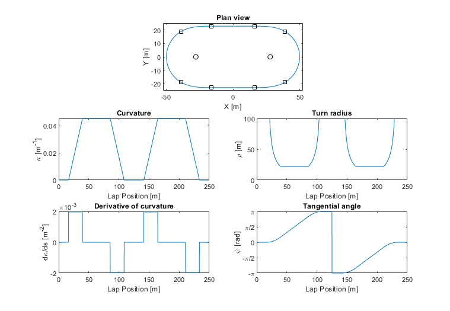
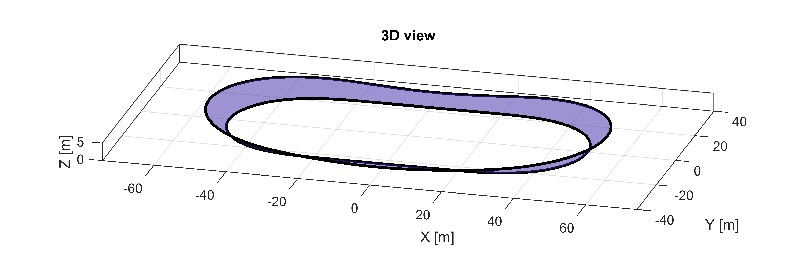

# VelodromeModel

VelodromeModel creates a velodrome track black-line model that consists of two straights, two circular arc bends and four transition curves between the bends and the straights. The transition curves are based on two different Ces&agrave;ro equations where the curvature along the arc length is defined. This provides controlling of the centripetal acceleration during cornering and has either _G_2 or _G_3 geometric continuity. 

The first option is for a generalised clothoid (also known as a Euler spiral or Cornu spiral). Here the curvature of the transition curve is a power function of its arc length and the exponent power, _n_, is required to be selected. A typical case is for _n_&nbsp;=&nbsp;1 which is the standard Euler spiral transition curve where the curvature increases linearly along the arc length. This is a _G_2 continuous curve. 

The second option is for a half-sine wave curvature profile where the curvature increases from zero to the bend curvature following a sinusoidal path. This is a _G_3 continuous curve. 

The measurable features that define the track are:
   * _Y_: The half-span between the two straights.
   * _R_: The turn radius at the bend apex.
   * _LL_: The lap length. This is generally a known, fixed value. 
   * _n_ (If a clothoid is chosen) the power of the change in curvature with length. Usually 1 (linear) 

The ratio of inputs _Y/R_ has a limited range of feasible solutions dependent on _LL_, _R_, and the curvature function that are checked before calculations begin. 

Requires Matlab r2019b or later. 

Corresponding article:

Fitzgerald S., Kelso R., Grimshaw P., Warr A. (2021) 'Impact of transition design on the accuracy of velodrome models', _Sports Engineering_, 24(23), https://doi.org/10.1007/s12283-021-00360-3.

The file `Velodome_Example.m` is provided to show the basic usage of this function. Shown below is the result with _LL_&nbsp;=&nbsp;250&nbsp;m, _Y_&nbsp;=&nbsp;23&nbsp;m, _R_&nbsp;=&nbsp;22&nbsp;m, and _n_&nbsp;=&nbsp;'sine'. 

The bank angle can also be included to produce a complete 3D model. 

