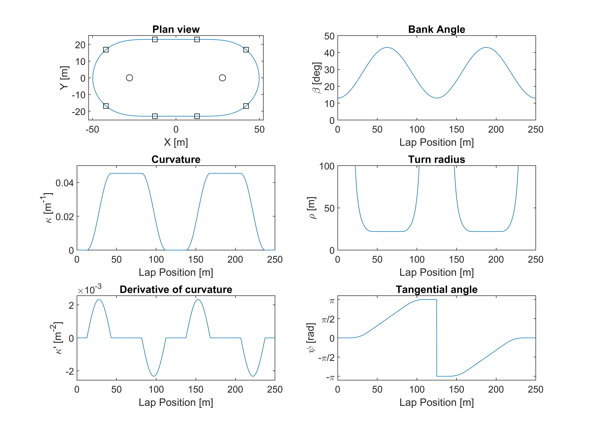

# VelodromeModel

VelodromeModel creates a velodrome track black-line model that consists of two straights, two circular arc bends and four transition curves between the bends and the straights. The transition curves are based on two different Cesaro equations where the curvature along the arc length is defined. This provides controlling of the centripetal acceleration during cornering and has either _G2_ or _G3_ geometric continuity. 

The first option is for a generalised clothoid (also known as a Euler spiral or Cornu spiral). Here the curvature of the transition curve is a power function of its arc length and the exponent power, _n_, is required to be selected. A typical case is for _n_&nbsp;=&nbsp;1 which is the standard Euler spiral transition curve where the curvature increases linearly along the arc length. This is a _G2_ continuous curve. 

The second option is for a sinusoidal curvature profile where the curvature increases from zero to the bend curvature following a half-sine wave path. This is a _G3_ continuous curve. 

The measurable features that define the track are:
   * _LL_: The lap length. This is generally a known, fixed value. 
   * _Y_: The half-width between the two straights.
   * _R_: The turn radius at the bend apex.
   
The ratio of inputs _Y/R_ has a limited range of feasible solutions dependent on _LL_, _R_, and the curvature function that are checked before calculations begin. 

A plan view of the velodrome model definitions 

The file `Velodome_Example.m` is provided to show the basic usage of this function. Shown below is the result with _LL_&nbsp;=&nbsp;250&nbsp;m, _Y_&nbsp;=&nbsp;23&nbsp;m, _R_&nbsp;=&nbsp;22&nbsp;m, and _n_&nbsp;=&nbsp;1. 

